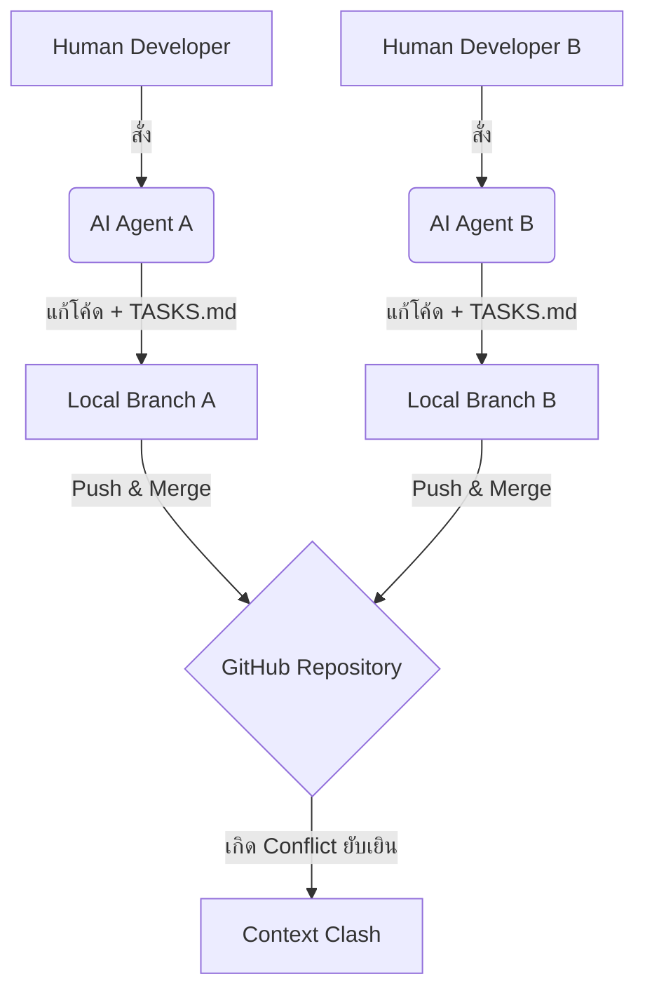

# บทที่ 35: The Multi-Human & Multi-Agent Team — คน 5 คน แชร์ AI Context ไม่ให้โค้ดชนกัน

---

## 🪝 มหกรรม Git Merge Conflict จากบอท 5 ตัว

ลองนึกถึงภาพโต๊ะทำงานในอู่ต่อเรือจำลองขนาดใหญ่ มีทีมวิศวกรออกแบบ 5 คนล้อมรอบโมเดลชิ้นเดียวกันอยู่ ต่างคนต่างมี "ผู้ช่วยช่างศิลป์" ส่วนตัวอีกคนละหนึ่งตัวคอยช่วยแปะกาว ตกแต่ง และตัดชิ้นส่วนไม้ตามคำสั่ง 

วิศวกรคนที่หนึ่งพูดว่า: *"ช่วยขยายขนาดปีกด้านขวาออกไปอีก 5 เซนติเมตร"* ผู้ช่วยของเขารีบวิ่งไปหั่นไม้ต่อเติมทันที 

ในวินาทีเดียวกัน วิศวกรคนที่สองโดยไม่ได้หันไปคุยกับคนแรกก็สั่งผู้ช่วยของเขาว่า: *"ช่วยขยายพัดลมระบายอากาศด้านขวาให้ใหญ่ขึ้น"* ผู้ช่วยคนที่สองวิ่งไปเจาะรูไม้จุดเดียวกับที่ปีกขวาจะประกบเข้าพอดี

ผลลัพธ์ที่ตามมาคืออะไร? แบบโมเดลพังยับเยิน ชิ้นส่วนชนกันกาวเปรอะเปื้อน และวิศวกรทั้งห้าคนต้องมานั่งรื้อเศษไม้ใหม่ตั้งแต่ต้น

นี่คือสิ่งที่เกิดขึ้นจริงเมื่อทีมพัฒนาซอฟต์แวร์นำ **Autonomous AI Agents** (เช่น Claude Code, Aider, หรือสคริปต์สแกนอัตโนมัติ) เข้ามาใช้ในชีวิตประจำวันพร้อมๆ กันโดยไม่มีการสถาปนาระบบควบคุมกระบวนการ (Workflow Rules) 

เมื่อนักพัฒนา 5 คน สั่งให้ AI 5 ตัวแก้ไขโค้ดขนานกันบน Git Branch ที่ต่างกัน หรือหนักข้อกว่านั้นคือการรันงานพร้อมกันบน Branch เดียวกันโดยไม่มีการซิงโครไนซ์สถานะไฟล์ **Context Drift (บริบทคลาดเคลื่อน)** และ **Merge Conflict** ในระดับวินาศสันตะโรจะกลายเป็นของขวัญต้อนรับยามเช้าของทีมคุณทันที

---

## 🏗️ Core Mechanic: ปัญหา Context Drift และสถาปัตยกรรม Git-Native AI

เพื่อไม่ให้ประวัติศาสตร์ซ้ำรอย เราจำเป็นต้องทำความเข้าใจการเกิดความขัดแย้งของบริบทในระบบการทำงานที่มี AI เป็นแกนหลัก (AI-Native Engineering)



ในการเขียนโค้ดของมนุษย์ทั่วไป เราแก้โค้ดทีละบรรทัด ค่อยๆ คิด ค่อยๆ คอมมิต แต่ AI Agent ทำงานในอัตราความเร็วที่แตกต่างกันลิบลับ มันสามารถสร้าง เขียน และย้ายไฟล์ได้ 20 ไฟล์ในเวลา 30 วินาที

ปัญหาใหญ่สามประการที่ทีมองค์กรต้องเผชิญคือ:
1. **การทับซ้อนของไฟล์บริบท (Context File Clashes):** หากเราใช้แนวปฏิบัติ Context Trinity (มี `CLAUDE.md`, `TASKS.md`, `DESIGN.md`) บอททุกตัวในทุก Branch ของวิศวกรทุกคนจะพยายามอัปเดตไฟล์ `TASKS.md` เพื่อรายงานสถานะของมัน เมื่อนำโค้ดมารวมกัน จะเกิด Conflict ในไฟล์ Markdown เหล่านี้แทบทุกวินาที
2. **Context Drift (การลืมบริบทที่เปลี่ยนแปลง):** บอทในคอมพิวเตอร์ของคุณไม่รู้ว่าบอทในเครื่องของเพื่อนร่วมทีมแก้ไขตัวแปรส่วนกลาง (Shared Utils) ไปอย่างไร ทำให้มันเขียนโค้ดต่อจากบริบทที่ล้าสมัย (Stale Context)
3. **Ghost Refactoring (การแก้เงียบ):** AI บางตัวมีความขยันเกินเหตุ เมื่อสั่งให้แก้บั๊กจุดเล็กๆ มันอาจแอบลุกขึ้นมารีแฟกเตอร์ดีไซน์คลาสใกล้เคียงที่ทีมอื่นกำลังเขียนทำงานอยู่จนชิ้นส่วนพัง

### วิธีแก้ปัญหา: กฎเหล็กสำหรับการแบ่งเขตควบคุม (Sandboxing rules)

เพื่อจัดการกับปัญหานี้ เราต้องวางระบบ **AI-Native Git Branching Strategy** ดังนี้:

- **1 Branch ต่อ 1 Task เล็กๆ เสมอ (Micro-branching):** ห้ามทำงานใหญ่หลายฟังก์ชันในกิ่งเดียวเด็ดขาด เพราะความกว้างของงานจะทำให้ AI สแกนโค้ดเกินขอบเขต
- **Commit History Sanitization:** ทุกครั้งที่ให้ AI รันลูปแก้บั๊กเสร็จสิ้น ต้องบังคับให้ทำ Git squash commit เพื่อไม่ให้ Git history เปรอะเปื้อนไปด้วยข้อความพร่ำเพ้อของ AI
- **Context Registry (สารบัญบริบท):** แยกไฟล์ติดตามงานออกเป็นรูปแบบไดนามิก ไม่ใช้ `TASKS.md` ผืนเดียวร่วมกัน แต่แบ่งตามรหัสตั๋วงาน (Ticket ID)

---

## 🔧 Hands-On: สคริปต์ Git Hook คุมพฤติกรรม AI และป้องกันการชนกัน

เพื่อควบคุมไม่ให้ AI ทำงานหลุดกรอบและป้องกันปัญหาระหว่างทำงานร่วมกันในทีม เราจะร่วมกันพัฒนาสคริปต์ Git Pre-commit Hook ด้วย Node.js 

สคริปต์ตัวนี้จะทำงานอัตโนมัติก่อนที่จะมีใครทำ git commit โดยทำหน้าที่:
1. **ตรวจจับการคอมมิตของ AI (Agent Detection):** ระบุว่าเป็นการส่งโค้ดจากบอทอัตโนมัติหรือไม่
2. **สแกนความขัดแย้งของ Context (Conflict Checker):** ป้องกันไม่ให้คอมมิตไฟล์เอกสารสำคัญร่วมกัน (`DESIGN.md`) หากพบว่ามีความล้าสมัยเมื่อเทียบกับกิ่งหลัก `main`
3. **ตรวจสอบความปลอดภัยของไฟล์ (Secret Leak Shield):** สแกนหาคำสำคัญหรือ API keys ทุกครั้งก่อนปล่อยโค้ดออกนอกเครื่อง

### การจัดเตรียมสคริปต์ `git-ai-shield.js`

สร้างสคริปต์นี้เก็บไว้ในโฟลเดอร์โครงการเพื่อใช้ร่วมกันในทีมพัฒนา:

```javascript
// tools/git-ai-shield.js
const { execSync } = require('child_process');
const fs = require('fs');
const path = require('path');

console.log('🛡️  Running AI-Native Pre-Commit Shield...');

// 1. ตรวจจับการหลุดรอดของความลับ (API Keys Detector)
const SECRET_PATTERNS = [
  /sk-ant-api[0-9a-zA-Z_-]{8,}/, // Anthropic API Key
  /sk-[a-zA-Z0-9]{48}/,           // OpenAI API Key
  /bearer\s+[a-zA-Z0-9._-]{20,}/i // General Bearer tokens
];

try {
  // ดึงรายการไฟล์ที่มีการเปลี่ยนแปลงและจะถูก Commit (Staged Files)
  const stagedFiles = execSync('git diff --cached --name-only', { encoding: 'utf8' })
    .split('\n')
    .filter(Boolean);

  if (stagedFiles.length === 0) {
    console.log('✅ No staged files found. Skipping.');
    process.exit(0);
  }

  // วนลูปตรวจสอบความปลอดภัยทีละไฟล์
  for (const file of stagedFiles) {
    if (!fs.existsSync(file)) continue;
    
    // ตรวจสอบเฉพาะไฟล์โค้ดและไฟล์ตั้งค่า
    const stat = fs.statSync(file);
    if (stat.isDirectory()) continue;
    
    const fileContent = fs.readFileSync(file, 'utf8');
    
    for (const pattern of SECRET_PATTERNS) {
      if (pattern.test(fileContent)) {
        console.error(`\n🚨 ERROR: ตรวจพบความลับหรือ API Key รั่วไหลในไฟล์: ${file}`);
        console.error(`Pattern matched: ${pattern}`);
        console.error('❌ บล็อกการ Commit เพื่อความปลอดภัย กรุณาย้ายความลับไปไว้ใน .env เสมอ!\n');
        process.exit(1);
      }
    }
  }

  // 2. ตรวจสอบการซิงโครไนซ์ของ Context Trinity
  const hasDesignChanged = stagedFiles.includes('DESIGN.md');
  if (hasDesignChanged) {
    // เช็กว่าเราเบลนด์ข้อมูลห่างจาก main ล่าสุดแล้วหรือยังเพื่อกัน Context Drift
    try {
      execSync('git fetch origin main', { stdio: 'ignore' });
      const diffCount = execSync('git rev-list --count HEAD..origin/main', { encoding: 'utf8' }).trim();
      
      if (parseInt(diffCount, 10) > 0) {
        console.error('\n⚠️ WARNING: DESIGN.md ของคุณอาจล้าสมัย!');
        console.error(`กิ่งหลัก main มีการอัปเดตใหม่จำนวน ${diffCount} commits ที่คุณยังไม่ได้ pull`);
        console.error('❌ กรุณาทำการ git pull origin main ก่อนอัปเดตไฟล์บริบทกลางเพื่อป้องกัน Conflict!\n');
        process.exit(1);
      }
    } catch (e) {
      // ทำงานแบบ Offline หรือเชื่อมต่อเซิร์ฟเวอร์หลักไม่ได้ ปล่อยผ่านเป็น warning
      console.log('⚠️ ไม่สามารถเชื่อมต่อรีโมตได้ ข้ามการเช็ก Context Drift ล่าสุด');
    }
  }

  // 3. จัดการแยกไฟล์ Task ย่อยของตัวเอง ป้องกันการชนกันที่ TASKS.md
  const hasSharedTaskChanged = stagedFiles.includes('TASKS.md');
  if (hasSharedTaskChanged) {
    console.warn('\n💡 คำแนะนำ: หลีกเลี่ยงการคอมมิตไฟล์ TASKS.md ผืนใหญ่โดยตรง');
    console.warn('แนะนำให้ใช้โฟลเดอร์ tasks/แยกตั๋วงานย่อย เช่น tasks/TICKET-123.md เพื่อไม่ให้ชนกับเพื่อนร่วมทีม\n');
  }

  console.log('✅ AI-Native Shield: ตรวจผ่านการตรวจสอบเรียบร้อยพร้อม Commit.');
  process.exit(0);

} catch (error) {
  console.error('❌ Shield execution error:', error.message);
  process.exit(1);
}
```

### การตั้งค่าลงใน Git Hooks

เพื่อให้สคริปต์นี้ทำงานอัตโนมัติทุกครั้งเมื่อพิมพ์คำสั่ง `git commit` ให้ทำการคัดลอกไฟล์หรือติดตั้งผ่านแพ็คเกจ `husky` หรือเขียนทับโดยตรงที่ไฟล์ `.git/hooks/pre-commit`:

```bash
# พิมพ์คำสั่งนี้ใน Terminal เพื่อเชื่อมสคริปต์เข้ากับระบบ Git Hook ท้องถิ่น
echo "node tools/git-ai-shield.js" > .git/hooks/pre-commit
chmod +x .git/hooks/pre-commit
```

เมื่อวิศวกรหรือบอท AI พยายามทำส่งโค้ดที่ขัดกฎ ตัวสคริปต์จะแทรกแซงและบล็อกทันที ทำให้ประวัติคอมมิตสะอาดและโค้ดไม่ชนกันอย่างไร้ระเบียบ

---

## 🔐 แนวทางปฏิบัติ: กติกาการแชร์บริบทของทีม 5 คน (The Code of Conduct)

การมีสคริปต์ป้องกันเป็นเพียงแค่ 50% ของความสำเร็จ อีกครึ่งหนึ่งคือการวางข้อตกลงในการทำงานของมนุษย์ (Team Agreement) นี่คือแนวทาง 3 ข้อหลักที่ทุกคนในทีมต้องตกลงร่วมกัน:

1. **กฎการบันทึกเอกสารของ Agent (Agent Logging Rule):**
   กำหนดให้ AI เขียนบันทึกการกระทำลงใน **Git Commit Message** ให้ละเอียด โดยแนะนำโครงสร้างหัวข้อดังนี้:
   ```
   feat(auth): [AI] เพิ่มฟังก์ชันตรวจสอบสิทธิ์ทาง SMS
   - สแกนและออกแบบโมเดลร่วมกับ Claude Vision
   - แก้ไขโครงสร้างไฟล์: /src/services/sms.service.ts
   - อัปเดตตั๋วงานย่อย: tasks/TICKET-847.md
   ```

2. **การอัปเดตไฟล์กติกาหลัก (`CLAUDE.md`):**
   ในฐานะผู้พัฒนาอาวุโส (Senior Developer) คุณควรเป็นผู้ดูแลกฎใน `CLAUDE.md` แต่เพียงผู้เดียว ห้ามบอท AI แก้ไขไฟล์นี้โดยพลการ ยกเว้นได้รับการกำกับดูแลอย่างใกล้ชิด เพื่อหลีกเลี่ยงการเกิด **Looping Rules (กฎย้อนแย้งตัวเอง)**

3. **การสื่อสารระดับมนุษย์ (Human Consensus):**
   ก่อนสั่งให้บอทเริ่ม Ralph Loop ขนาดใหญ่ (เช่น เขียนเทสครอบคลุมทั้งโฟลเดอร์ข้ามคืน) จะต้องส่งสัญญาณแจ้งเตือนสั้นๆ ในทีมแชท (Slack/Teams) เพื่อให้คนอื่นหลีกเลี่ยงการแก้สถาปัตยกรรมหลักในโมดูลนั้นขนานกันในช่วงเวลานั้น

---

## 🎯 สรุปบทที่ 35

| ปัญหาการชนกัน | อาการที่พบ | แนวทางจัดการที่ดีที่สุด |
|---------------|------------|-------------------------|
| **Context Drift** | บอทเขียนโค้ดอิงจากดีไซน์เก่าที่เพื่อนเพิ่งแก้ไป | บังคับให้บอทเริ่มการทำงานด้วยการสั่ง Pull/Fetch เสมอ |
| **TASKS.md Conflict** | เกิดการแย่งกันเขียนไฟล์ Markdown บันทึกงาน | เปลี่ยนมาใช้ระบบแยกไฟล์แบบตั๋วงาน `tasks/TICKET-XYZ.md` |
| **Secret Leaks** | บอทแอบแคชคำสั่งหรือดึงคีย์ API จากเครื่องมาคอมมิต | ใช้ Git Pre-commit Shield สแกน Pattern คีย์ความลับ |

---

## 📋 Action Items ก่อนไปบทที่ 36

- [ ] สร้างไฟล์สคริปต์สแกนความปลอดภัย `git-ai-shield.js` ไว้ในโปรเจกต์ของทีม
- [ ] ติดตั้ง Git Hook ไปยังเครื่องคอมพิวเตอร์ของเพื่อนร่วมทีมทุกคน
- [ ] กำหนดนโยบายและแจ้งให้สมาชิกทีมทราบเรื่องหลีกเลี่ยงการคอมมิต `CLAUDE.md` โดยบอทแบบไร้ระเบียบ

---

*ใน **บทที่ 36** เราจะเชื่อมระบบความปลอดภัยระดับเครื่องผู้ใช้ขึ้นสู่ Cloud ด้วย **AI in CI/CD (GitHub Actions)** เรียนรู้วิธีตั้งบอทสแกนโค้ดวิจารณ์ Pull Request (Automated PR Reviewer) อัตโนมัติทันทีที่โค้ดมาถึงระบบส่วนกลางกันครับ*
