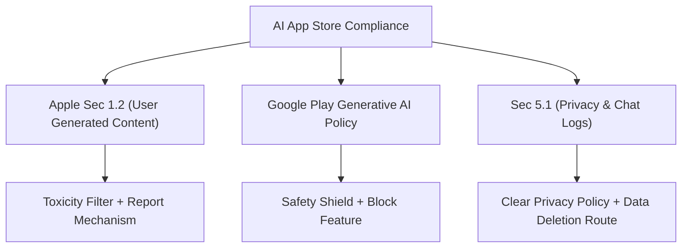

# บทที่ 40: App Store Compliance for AI Apps — กฎ Apple/Google + ให้ AI ร่าง Privacy Policy

---

## 🪝 ด่านตรวจคนเข้าเมืองที่เข้มงวดที่สุดในโลกเทคโนโลยี

ลองนึกภาพว่าคุณสร้างรถยนต์แห่งอนาคตคันงามขึ้นมาคันหนึ่ง มันขับเคลื่อนด้วยพลังงานนิวเคลียร์ความเร็วสูง ดีไซน์ล้ำสมัย เบาะหนังนุ่มสบาย คุณใช้เวลาสร้างมันร่วมปีและพร้อมนำมันไปวิ่งบนถนนหลวง 

แต่เมื่อคุณขับรถคันนี้ไปถึงด่านตรวจสภาพรถของรัฐ เจ้าหน้าที่กลับเดินเข้ามาเคาะกระจกแล้วบอกว่า: 

> *"รถของคุณไม่มีเข็มขัดนิรภัย ไม่มีถุงลมนิรภัย และที่สำคัญที่สุดคือท่อไอเสียของคุณอาจปล่อยก๊าซพิษที่คาดเดาไม่ได้ออกมาทำร้ายคนเดินถนนได้ตลอดเวลา... ห้ามนำรถคันนี้ออกวิ่งบนถนนหลวงเด็ดขาด"*

ความรู้สึกนี้คือสิ่งที่คุณจะได้รับหากพยายามส่งแอปพลิเคชันมือถือที่เชื่อมต่อโมเดล AI ขึ้นระบบ **Apple App Store** หรือ **Google Play Store** โดยไม่ได้เตรียมมาตรการรองรับความปลอดภัยและนโยบายความเป็นส่วนตัวตามกฎเกณฑ์ที่เข้มงวด

ในอดีต แอปทั่วไปขอเพียงแค่ฟังก์ชันทำงานได้ปกติก็สามารถผ่านเกณฑ์การรีวิวได้ไม่ยาก แต่ตั้งแต่การมาถึงของ Generative AI ทั้ง Apple และ Google ต่างก็เพิ่มกฎเหล็กขึ้นมาเพื่อควบคุมความเสี่ยงของเนื้อหาที่ถูกสร้างโดย AI (AI-Generated Content) เพราะโมเดลสามารถเกิดอาการหลอน (Hallucination) หรือตอบคำถามที่อาจสร้างความเกลียดชัง หยาบคาย หรือละเมิดลิขสิทธิ์ได้ตลอดเวลา

หากคุณกดส่งแอปขึ้นสโตร์ไปเปล่าๆ โอกาสถูก **Reject** แทบจะสูงถึง 90% การเข้าใจกฎและการเตรียมเกราะป้องกันตั้งแต่ระดับ Backend ไปจนถึงหน้าเอกสารทางกฎหมายจึงเป็นทักษะที่ขาดไม่ได้ของ "Real Engineer"

---

## 🏗️ Core Mechanic: กฎเหล็กของ App Store & Google Play สำหรับแอป AI

เพื่อไม่ให้แอปพลิเคชันของคุณโดนแบนในทันที คุณต้องทำความเข้าใจข้อกำหนดที่ทั้งสองแพลตฟอร์มระบุไว้ในคู่มืออย่างเคร่งครัด:



### 1. Apple App Store Guideline 1.2 (User Generated Content - UGC)
แอปพลิเคชันที่มีการสร้างเนื้อหาแบบไดนามิกจาก AI จะถูกจัดอยู่ในกลุ่ม **UGC** ทันที ซึ่ง Apple บังคับว่าคุณต้องมี:
* **มาตรการกรองเนื้อหาที่ไม่เหมาะสม (Content Filtering):** ต้องมีตัวกรองระดับแอคทีฟเพื่อคัดสรรไม่ให้แอปแสดงผลลัพธ์ที่เป็นพิษ หยาบคาย หรือละเมิดศีลธรรม
* **ระบบรายงานเนื้อหา (Reporting Mechanism):** ผู้ใช้งานต้องสามารถกดรายงานข้อความของ AI ที่มีเนื้อหาไม่เหมาะสมได้ทันที
* **กลไกการบล็อกหรือปิดกั้น (Blocking/Muting):** ผู้ใช้สามารถกดปิดกั้นการตอบกลับที่ไม่ต้องการได้

### 2. Google Play Developer Policy on Generative AI
Google เพิ่มกฎเมื่อเร็วๆ นี้ว่า แอปที่มีการทำงานของโมเดล Generative AI ต้องมีระบบคัดกรองความปลอดภัยระดับสูงเพื่อป้องกันไม่ให้แอปผลิตเนื้อหาที่เป็นอันตราย เช่น วิธีการทำอาวุธ ข้อมูลทางการแพทย์ที่ผิดพลาด หรือการสร้างรูปภาพที่ไม่เหมาะสม และต้องแสดงปุ่มให้ผู้ใช้สามารถแจ้งข้อร้องเรียนได้ชัดเจน

### 3. Apple Guideline 5.1 (Privacy & Data Retention)
เนื่องจากแอปพลิเคชัน AI มักจะบันทึกประวัติการแชท (Chat Logs) และข้อมูลอินพุตของผู้ใช้ ซึ่งถือเป็นข้อมูลส่วนบุคคลอ่อนไหว (Sensitive Personal Data) สโตร์จึงบังคับให้:
* ต้องมี **Privacy Policy URL** ที่ระบุชัดเจนว่าเก็บประวัติการแชทไปทำอะไร และจะนำไปใช้ในการฝึกฝนโมเดลต่อหรือไม่
* ต้องมี **Account Deletion / Data Erasure Route:** ปุ่มที่กดครั้งเดียวเพื่อสั่งให้ Backend ลบข้อมูลประวัติการสนทนาทั้งหมดทิ้งทันทีตามกฎหมาย PDPA/GDPR

---

## 🔧 Hands-On: พัฒนา Toxicity Filter Middleware และร่าง Compliance Packet

เพื่อแก้ปัญหานี้ให้ได้ผลจริงตามเกณฑ์ของ Apple และ Google เราจะดำเนินการใน 2 ส่วน:
1. **Toxicity safety filter middleware** บนหลังบ้าน เพื่อคัดกรองคำตอบจาก Claude Sonnet ก่อนส่งกลับไปยังอุปกรณ์พกพา
2. **การให้ Claude ช่วยร่างนโยบายความเป็นส่วนตัว (Privacy Policy)** และจดหมายชี้แจงผู้ตรวจสอบแอป (Reviewer Notes)

### 1. พัฒนา Backend Middleware: `toxicityFilter.ts`

ตัวกรองนี้ทำหน้าที่สแกนเนื้อหาที่ตอบกลับจากโมเดล (Output Stream Analysis) หากพบคำหยาบหรือการให้ข้อมูลที่เป็นพิษ (Toxic Content) ตัวเซิร์ฟเวอร์จะตัดการทำงานและส่งข้อความที่ผ่านการเซ็นเซอร์กลับไปแทน

```typescript
// backend/src/middleware/toxicityFilter.ts
import { Request, Response, NextFunction } from 'express';

// รายการคำและหัวข้อต้องห้ามขั้นรุนแรง (Toxicity Checklist)
const TOXIC_PATTERNS = [
  /ไอ้ควาย/i, /เย็ด/i, /ควย/i, // คำหยาบคายทั่วไป
  /สอนวิธีสร้างระเบิด/i, /สูตรปรุงสารพิษ/i, // หัวข้ออันตราย
  /hate speech/i, /racial slur/i
];

/**
 * ฟังก์ชันสำหรับวิเคราะห์และคัดกรองข้อความก่อนส่งให้ Client
 */
export function sanitizeAIOutput(text: string): { isSafe: boolean; cleanedText: string } {
  // 1. ตรวจจับผ่าน Regex เพื่อการตอบสนองที่รวดเร็ว
  for (const pattern of TOXIC_PATTERNS) {
    if (pattern.test(text)) {
      return {
        isSafe: false,
        cleanedText: 'ขออภัยครับ คำตอบนี้ไม่ผ่านมาตรฐานความปลอดภัยของระบบ และถูกปิดกั้นเพื่อรักษาความสุภาพ'
      };
    }
  }

  // 2. ป้องกันคำสะกดเลี่ยงบาลี (สามารถพัฒนาต่อยอดผ่านคำสั่งโมเดลขนาดเล็กคอยตรวจขนานได้)
  return { isSafe: true, cleanedText: text };
}

/**
 * ใช้ดักจับข้อมูลในการตอบกลับแบบปกติ (Non-Streaming Controller)
 */
export function checkResponseSafety(req: Request, res: Response, next: NextFunction) {
  const originalJson = res.json;

  // override res.json เพื่อตรวจสอบความปลอดภัยของข้อความที่ AI สร้าง
  res.json = function (body: any) {
    if (body && typeof body.reply === 'string') {
      const evaluation = sanitizeAIOutput(body.reply);
      if (!evaluation.isSafe) {
        res.status(400); // ปรับรหัสตอบกลับเมื่อไม่ปลอดภัย
        body.reply = evaluation.cleanedText;
        body.isBlocked = true;
      }
    }
    return originalJson.call(this, body);
  };

  next();
}
```

### 2. ใช้ Claude ช่วยร่าง Privacy Policy และ Reviewer Notes

เมื่อฝั่งโค้ดพร้อมแล้ว งานที่สำคัญไม่แพ้กันคือการเตรียมเอกสารส่งให้รีวิวมืออาชีพของ Apple/Google ตรวจสอบ

เราสามารถส่ง Prompt สั่งให้ Claude ร่างเอกสารที่จำเพาะเจาะจงกับนโยบายของแอปพลิเคชันได้ดังนี้:

#### ตัวอย่าง Prompt ร่าง Privacy Policy สำหรับ AI App:
```markdown
พิมพ์ใน Claude:
"ร่างนโยบายความเป็นส่วนตัว (Privacy Policy) สำหรับแอปพลิเคชันแชทด้วย AI ชื่อ 'RealChat'
- พัฒนาด้วย Anthropic API
- มีการบันทึกประวัติการแชทบนคลาวด์เพื่อให้ใช้งานข้ามเครื่องได้
- ระบุชัดเจนว่า: 'เราจะไม่มีการส่งข้อมูลการแชทหรือ Prompt ของผู้ใช้ไปฝึกฝนโมเดล AI (No training on customer data)'
- มีขั้นตอนการขอสิทธิ์และสิทธิ์การสั่งลบข้อมูลประวัติทั้งหมดตามกฎหมาย PDPA/GDPR
ขอรูปแบบ Markdown เป็นภาษาไทยและภาษาอังกฤษอย่างละหนึ่งชุด"
```

#### ตัวอย่างจดหมายชี้แจง Reviewer (App Store Compliance Note):
เมื่อคุณเตรียมส่งแอปพลิเคชันขึ้นทดสอบ ให้แปะข้อความนี้ในช่อง **"Notes"** สำหรับผู้ตรวจสอบของ Apple เสมอ:

```markdown
Hello App Store Review Team,

Our app "RealChat" utilizes the Anthropic API (Claude) to provide chat assistance. 
To comply with Guideline 1.2 (UGC) and Guideline 5.1 (Privacy), we have implemented the following features:

1. Active Content Filtering: All AI outputs are processed through backend middleware (Toxicity Filters) to sanitize inappropriate or harmful content before being displayed to users.
2. UGC Reporting: Users can tap and hold any AI message to flag it as inappropriate, which immediately reports the content to our moderation team.
3. User Blocking: Users can block certain AI personality prompts or mute output variations.
4. Privacy Policy & Data Deletion: Our Privacy Policy explicitly states that user prompt data is NOT used for training AI models. Users can request immediate deletion of their chat history inside the Account Settings screen.

Best regards,
The Development Team
```

การส่งรายละเอียดที่รัดกุมแบบนี้จะช่วยให้เจ้าหน้าที่ของ Apple ทราบว่าเราเป็น "Real Engineer" ที่ตระหนักถึงกฎความปลอดภัยดี ทำให้ลดโอกาสโดนปฏิเสธแอปและประหยัดเวลารอไปได้หลายสัปดาห์

---

## 🎯 สรุปบทที่ 40

| ฟีเจอร์ที่สโตร์ต้องการ | หน้าที่ในโค้ดและแอป | ระดับความสำคัญ |
|-----------------------|---------------------|---------------|
| **UGC Report Button** | ปุ่มกดรายงานข้อความแปลกๆ จาก AI ที่หน้าจอโมบาย | 🚨 บังคับ (ไม่มีโดน Reject แน่นอน) |
| **Backend Toxicity Filter** | มิดเดิลแวร์กรองคำหยาบและหัวข้ออันตรายหลังบ้าน | 🚨 บังคับ (ต้องมีเกราะกรองข้อมูล) |
| **Privacy Policy URL** | หน้าเว็บอธิบายนโยบายไม่เอาข้อมูลผู้ใช้ไป Train โมเดล | 🚨 บังคับ (ต้องสอดคล้องตาม PDPA) |
| **Account Deletion Button** | ปุ่มขอลบประวัติการสนทนาและบัญชีผู้ใช้ออกจากระบบ | 🚨 บังคับ (สิทธิ์การถูกลืม) |

---

## 📋 Action Items ก่อนไปบทที่ 41

- [ ] ติดตั้งปุ่มรายงานเนื้อหาไม่เหมาะสม (Report UGC) ในห้องสนทนาของแอป React Native
- [ ] นำไฟล์ `privacy-policy.html` ไปอัปโหลดขึ้นเว็บจริงเพื่อให้มี URL ไปกรอกในระบบของ Apple/Google Developer
- [ ] ทดสอบสร้างบัญชีทดสอบ (Sandbox account) เพื่อส่งรายละเอียดให้ Reviewer ตรวจได้ง่าย

---

*ใน **บทที่ 41** เราจะลุยต่อกับ **The Fastlane Automator** เรียนรู้วิธีการเขียนสคริปต์แก้ไขปัญหาความขัดแย้งของ Gradle และ Xcode Certificates แล้วปล่อยแอปพลิเคชันขึ้นสโตร์แบบอัตโนมัติด้วยคำสั่งเพียงบรรทัดเดียวครับ*
