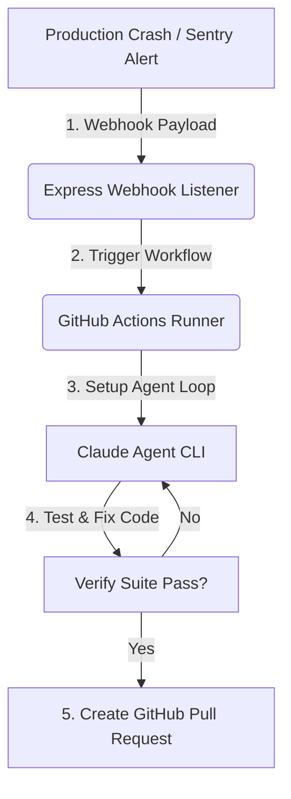

# บทที่ 42: [Capstone Vol 3] The Enterprise Auto-Fix Pipeline — Error → AI สร้าง PR แก้บั๊ก → รอกด Merge

---

## 🪝 หุ่นยนต์ซ่อมแซมแผงวงจรขณะที่โรงงานยังทำงาน

ลองจิตนาการถึงโรงงานทอผ้าอัตโนมัติขนาดใหญ่ที่มีเครื่องจักรทำงานประสานกันนับร้อยเครื่อง โดยปกติแล้ว หากเกิดปัญหาเส้นด้ายพันกันหรือฟันเฟืองติดขัดที่เครื่องจักรหมายเลข 84 ระบบจะส่งเสียงสัญญาณไซเรนดังลั่นไปทั่วโรงงาน 

ทีมช่างซ่อมบำรุงที่เป็นมนุษย์ต้องลุกขึ้นมาสวมชุดป้องกัน ถือเครื่องมือ เดินหาสาเหตุ ถอดชิ้นส่วน แก้ไขปัญหา และประกอบคืน ซึ่งขั้นตอนนี้อาจกินเวลาตั้งแต่ 30 นาทีไปจนถึงครึ่งค่อนวัน โดยที่ระหว่างนั้นสายการผลิตต้องหยุดชะงัก (Downtime)

แต่ในโรงงานอัจฉริยะยุคใหม่ ทันทีที่เซ็นเซอร์ตรวจพบว่าฟันเฟืองจุดที่ 84 ติดขัด แขนกลอัจฉริยะที่ห้อยตัวอยู่บนเพดานจะวิ่งไปที่จุดเกิดเหตุทันที มันทำการสแกนประวัติการทำงาน คาดเดาชิ้นส่วนที่สึกหรอ หยิบไขควงและอะไหล่จากคลังมาสับเปลี่ยน ทดสอบการหมุนของเฟืองจนมั่นใจว่าผ่าน 100% แล้วเดินกลับไปประจำที่พร้อมส่งรายงานสรุปสั้นๆ เข้าแท็บเล็ตของวิศวกรผู้ควบคุมว่า *"ซ่อมแซมเครื่อง 84 เรียบร้อยแล้ว สภาพการทำงานกลับสู่ปกติ 100%"* โดยที่วิศวกรเพียงแค่กดปุ่ม "ตกลง" เพื่อยืนยันการรับทราบ

ในโลกของการพัฒนาซอฟต์แวร์ระดับองค์กร การซ่อมบำรุงแบบนี้เรียกว่า **Self-Healing Production** หรือ **Auto-Fix Pipeline**

ในบทสุดท้ายของ Volume 3 นี้ เราจะนำทักษะทั้งหมดที่เราเรียนรู้มาตลอดเล่ม ทั้งเรื่อง Model Context Protocol (MCP), CI/CD Integration, API Security, และ Agent Orchestration มาร้อยเรียงเข้าด้วยกันเพื่อสร้างระบบซ่อมโค้ดอัตโนมัติ: **เมื่อเกิด Error บนระบบ Production หรือระหว่างทำ Code Integration -> ระบบจะเรียก AI มาวิเคราะห์ Stack Trace เขียนเทสทวนสอบ เขียนโค้ดแก้ไข รันระบบเทสจนผ่านหมด แล้วยื่นข้อเสนอขอ Merge โค้ด (Pull Request) ให้ Senior Developer กดปุ่มอนุมัติผ่านมือถือได้ทันที**

---

## 🏗️ Core Mechanic: สถาปัตยกรรมไปป์ไลน์แก้ไขข้อผิดพลาดอัตโนมัติ

ไปป์ไลน์แบบหมุนวนปิด (Closed-Loop Auto-Fix Pipeline) ประกอบด้วย 5 ขั้นตอนหลักที่ประสานงานกันอย่างเป็นระบบ:



1. **Detection (ดักจับ):** ระบบติดตามข้อผิดพลาด เช่น Sentry, Datadog หรือระบบ Logging ตรวจพบ Uncaught Exception และทำการส่งข้อมูล Stack Trace รวมถึงขอบเขตไฟล์ผ่าน Webhook
2. **Orchestration (ประสานงาน):** เซิร์ฟเวอร์มิดเดิลแวร์คอยรับ Webhook แล้วสั่งทริกเกอร์ GitHub Actions Workflow (หรือ Container Task) พร้อมส่งข้อมูลตัวแปรสภาพแวดล้อมและ Stack Trace ไปด้วย
3. **Execution (ดำเนินการ):** GitHub Runner สั่งรันบอท AI (เช่น Claude Code CLI) ในพื้นที่จำลอง (Sandbox) โดยให้บริบทของ Stack Trace และสั่งให้บอทค้นหาต้นตอบั๊ก
4. **Validation (ตรวจสอบ):** บอทต้องสร้างสคริปต์ทดสอบ (Unit Test) เพื่อพิสูจน์บั๊กก่อน จากนั้นลงมือแก้โค้ด แล้วรันคำสั่งเทสของโครงการจนกว่าจะผ่านทั้งหมด เพื่อการันตีว่าจะไม่มีบั๊กรั่วไหล (No regression)
5. **Reporting (ส่งงาน):** บอททำการ push กิ่งโค้ดขึ้นระบบ และเรียก GitHub API เพื่อสร้าง Pull Request (PR) พร้อมอธิบายสาเหตุ วิธีแก้ และแนบผลทดสอบเพื่อรอให้มนุษย์รีวิวอีกครั้ง

---

## 🔧 Hands-On: พัฒนา Webhook Listener และ GitHub Action Workflow

เราจะร่วมกันสร้างชิ้นส่วนสำคัญ 2 ชิ้นเพื่อให้ระบบนี้ทำงานได้จริง:
1. **Webhook Listener Server** ใน Node.js/Express เพื่อรับข้อผิดพลาดจากภายนอก
2. **GitHub Actions Workflow YAML** สำหรับเรียก Claude ไปดำเนินการแก้ไขใน Repository

### 1. โค้ดฝั่งรับเหตุการณ์ผิดพลาด: `webhookListener.ts`

ตัวเซิร์ฟเวอร์หลังบ้านนี้จะคอยฟังพิกัดความเสียหาย เมื่อมีรายงานข้อผิดพลาดส่งเข้ามา มันจะดึง Stack Trace และส่งคำขอ `POST` ไปที่ GitHub API เพื่อปลุกให้ Workflow ทำงาน

```typescript
// ops-server/src/webhookListener.ts
import express, { Request, Response } from 'express';
import axios from 'axios';

const app = express();
app.use(express.json());

const GITHUB_TOKEN = process.env.GITHUB_PAT_TOKEN; // Personal Access Token ที่มีสิทธิ์คุม Repo
const REPO_OWNER = 'your-org';
const REPO_NAME = 'core-app';

app.post('/webhooks/error-alerts', async (req: Request, res: Response) => {
  const { error_message, stack_trace, file_path, line_number } = req.body;

  if (!error_message || !stack_trace) {
    return res.status(400).json({ error: 'Missing required payload fields' });
  }

  console.log(`⚠️ Alert Received: ${error_message} in ${file_path}:${line_number}`);

  try {
    // ส่งสัญญาณไปเปิด GitHub Actions Workflow ผ่าน API
    const response = await axios.post(
      `https://api.github.com/repos/${REPO_OWNER}/${REPO_NAME}/actions/workflows/auto-fix.yml/dispatches`,
      {
        ref: 'main', // รันบนกิ่งหลัก
        inputs: {
          errorMessage: error_message,
          stackTrace: stack_trace,
          filePath: file_path || 'unknown',
          lineNumber: String(line_number || 0)
        }
      },
      {
        headers: {
          Authorization: `token ${GITHUB_TOKEN}`,
          Accept: 'application/vnd.github.v3+json'
        }
      }
    );

    return res.status(200).json({
      status: 'success',
      message: 'Auto-fix workflow triggered successfully',
      githubStatus: response.status
    });
  } catch (error: any) {
    console.error('Failed to trigger workflow:', error.response?.data || error.message);
    return res.status(500).json({ error: 'Internal server error triggering workflow' });
  }
});

const PORT = process.env.PORT || 4000;
app.listen(PORT, () => console.log(`🚀 Webhook listener active on port ${PORT}`));
```

### 2. โค้ดฝั่ง GitHub Actions Runner: `.github/workflows/auto-fix.yml`

นี่คือไฟล์นิยามคำสั่งของ GitHub ที่จะไปตั้งค่าให้ระบบเซ็ตอัปสิ่งแวดล้อม ติดตั้งโมเดล และสั่งให้ Claude ทำการแก้ไขบั๊กพร้อมส่ง Pull Request อัตโนมัติ

```yaml
# .github/workflows/auto-fix.yml
name: Autonomous Auto-Fix Pipeline

on:
  workflow_dispatch:
    inputs:
      errorMessage:
        description: 'Error message from Sentry/Alert system'
        required: true
      stackTrace:
        description: 'Stack trace details'
        required: true
      filePath:
        description: 'Target file location'
        required: false
      lineNumber:
        description: 'Line number'
        required: false

jobs:
  healing-agent:
    runs-on: ubuntu-latest

    steps:
      - name: Checkout Codebase
        uses: actions/checkout@v4
        with:
          fetch-depth: 0

      - name: Setup Node.js Environment
        uses: actions/setup-node@v4
        with:
          node-version: '20'
          cache: 'npm'

      - name: Install Project Dependencies
        run: npm ci

      - name: Install Claude Code CLI
        run: npm install -g @anthropic-ai/claude-code

      - name: Execute Autonomous Healing Loop
        env:
          ANTHROPIC_API_KEY: ${{ secrets.ANTHROPIC_API_KEY }}
          ERROR_MSG: ${{ github.event.inputs.errorMessage }}
          STACK_TRACE: ${{ github.event.inputs.stackTrace }}
          TARGET_FILE: ${{ github.event.inputs.filePath }}
        run: |
          # สร้าง Branch ใหม่สไตล์ Micro-branching เพื่อกันสับสน
          BRANCH_NAME="fix/auto-heal-$(date +%s)"
          git checkout -b $BRANCH_NAME
          
          # ส่งคำสั่งให้บอท Claude ผ่าน CLI เพื่อค้นหาสาเหตุและแก้บั๊กแบบปิดลูป
          # บังคับกติกา: เขียนเทสก่อน -> แก้ไข -> รันเทสผ่าน -> อัปเดตตั๋วงาน
          claude "อ่านรายงานข้อผิดพลาดนี้: '$ERROR_MSG'
          Stack Trace:
          $STACK_TRACE
          
          พิกัดความเสียหายที่อาจเกิดขึ้น: $TARGET_FILE
          
          คำสั่งบังคับ:
          1. ไปที่โฟลเดอร์ทดสอบ เขียน Unit test ทวนสอบปัญหาในไฟล์ที่เหมาะสมเพื่อสร้างการทวนสอบย้อนกลับ (Regression Test)
          2. แก้ไขโค้ดในจุดที่ผิดพลาด
          3. รันคำสั่ง 'npm test' เพื่อทดสอบให้มั่นใจว่าเทสใหม่และเทสเดิมผ่าน 100%
          4. เมื่อตรวจสอบผ่านทั้งหมดแล้ว ให้พิมพ์ข้อความสั้นๆ อธิบายสิ่งที่ทำ"
          
          # ตรวจสอบการเปลี่ยนแปลงของ Git
          git status
          
          # ตั้งค่า Git config ชี้ว่าเป็นบอท
          git config --global user.name "AI Auto-Healer Bot"
          git config --global user.email "bot@your-company.com"
          
          # Commit และ Push โค้ดขึ้นรีโมต
          git add -A
          git commit -m "fix(auto-heal): แก้ไขบั๊กอัตโนมัติสำหรับ $ERROR_MSG"
          git push origin $BRANCH_NAME
          
          # ดึงค่า Branch name ออกไปใช้ในสเต็ปสร้าง PR
          echo "BRANCH_NAME=$BRANCH_NAME" >> $GITHUB_ENV

      - name: Create Pull Request with GitHub CLI
        env:
          GH_TOKEN: ${{ secrets.GITHUB_TOKEN }}
          ERROR_MSG: ${{ github.event.inputs.errorMessage }}
        run: |
          gh pr create \
            --title "🤖 AI Auto-Fix: แก้บั๊ก $ERROR_MSG" \
            --body "### ระบบตรวจพบบั๊กและทำการแก้ไขอัตโนมัติเรียบร้อยแล้ว
            
            **รายละเอียดข้อผิดพลาด:**
            - **ข้อความ:** $ERROR_MSG
            
            **งานที่ดำเนินการ:**
            - [x] เขียน Unit test ทวนสอบปัญหาเพื่อกันการกลับมาเกิดซ้ำ
            - [x] แก้ไขซอร์สโค้ดในจุดเกิดเหตุ
            - [x] รันชุดทดสอบ 'npm test' ผ่านเรียบร้อยแล้ว
            
            *กรุณาตรวจสอบโค้ดและยืนยันการ Merge ขึ้นระบบหลักต่อไปครับ*" \
            --base main \
            --head ${{ env.BRANCH_NAME }}
```

---

## 🛡️ ป้องกันระบบพัง: มาตรการ Fail-Safe และ Sandbox Security

เนื่องจากเรากำลังปล่อยให้บอท AI แก้ไขโค้ดและส่งขึ้น GitHub แบบกึ่งอัตโนมัติ เพื่อไม่ให้ระบบที่ทำงานอยู่พังพินาศ หรือเปิดช่องให้เกิด Prompt Injection เจาะเข้าไปในระบบ CI/CD เราจำเป็นต้องมีเกราะป้องกัน **Fail-Safe** 3 ประการ:

1. **จำกัดสิทธิ์ Token สูงสุด (Restrictive GitHub Token):**
   กำหนดให้ `GITHUB_TOKEN` ในระบบ GitHub Actions มีสิทธิ์เขียนเฉพาะการสร้าง PR เท่านั้น (`contents: write`, `pull-requests: write`) ห้ามบอทกด Merge โค้ดเข้ากิ่งหลักด้วยตัวเองเด็ดขาด! มนุษย์ (Senior Developer) จะต้องเป็นประตูด่านสุดท้ายในการกด Merge เสมอ
2. **การจำกัดการใช้งาน Tokens และเวลาทำงาน (Timeout Limits):**
   ตั้งค่า `timeout-minutes: 15` ใน Workflow ของ GitHub เสมอ เพื่อป้องกันไม่ให้บอท Claude เกิดลูปการแก้โค้ดซ้ำๆ วนเวียนไม่รู้จบ (Infinity Loop) ซึ่งอาจส่งผลให้เสียค่าโควตา API มหาศาล
3. **Isolate Sandbox Execution:**
   ห้ามรันการซ่อมแซมตัวเองบนเครื่องแม่ข่าย Production โดยตรง แต่ต้องให้ระบบทำงานบน Docker Container หรือ VM ที่ใช้ครั้งเดียวทิ้ง (Ephemeral Runner) ของ GitHub Actions เสมอ เพื่อความปลอดภัยจากการประมวลผลโค้ดแปลกปลอม

---

## 🎯 สรุปบทที่ 42

| องค์ประกอบไปป์ไลน์ | หน้าที่สำคัญ | เทคโนโลยีที่เกี่ยวข้อง |
|--------------------|--------------|-----------------------|
| **Webhook Listener** | รอฟังพิกัดความเสียหายจากระบบ Monitor และแปลงข้อมูล | Express, Axios, Sentry |
| **GitHub Actions** | สร้างพื้นที่จำลองเพื่อดึงโค้ดและเตรียมสภาพแวดล้อมรันบอท | Ubuntu Runner, Node.js |
| **Claude CLI Agent** | วิเคราะห์ปัญหา เขียนเทส และลงมือแก้ไขโค้ดจนกว่าจะถูกต้อง | `@anthropic-ai/sdk`, Jest/Mocha |
| **GitHub CLI (`gh`)** | ส่งผลงานกลับขึ้น Repo และสร้าง Pull Request รอมนุษย์ตรวจ | GitHub CLI |

---

## 📋 Action Items ก่อนไปบทที่ 43

- [ ] สร้างไฟล์ `.github/workflows/auto-fix.yml` ในโปรเจกต์ของบริษัท
- [ ] ติดตั้งสิทธิ์ `secrets.ANTHROPIC_API_KEY` เข้าไปในรีโพสิทอรีหลัก
- [ ] จำลองข้อผิดพลาดขึ้นในโปรเจกต์ (เช่น สร้างฟังก์ชันหารด้วยศูนย์) เพื่อทริกเกอร์ระบบให้ Auto-Fix ทำงานจริง

---

*ยินดีด้วยครับ! คุณเพิ่งปิดเล่ม **Volume 3: Enterprise AI & MCP** สำเร็จอย่างสมบูรณ์แบบ!*

*ใน **Volume 4 (AI Ops & Site Reliability)** เล่มสุดท้ายของหนังสือชุดนี้ เราจะเริ่มต้นด้วย **บทที่ 43: LLM Observability & Tracing** เจาะลึกการวางระบบสอดแนม Telemetry ผ่าน LangSmith หรือ OpenTelemetry เพื่อให้แน่ใจว่า AI ของเราจะไม่หลบซ่อนพฤติกรรมแปลกๆ บนโปรดักชันครับ*
